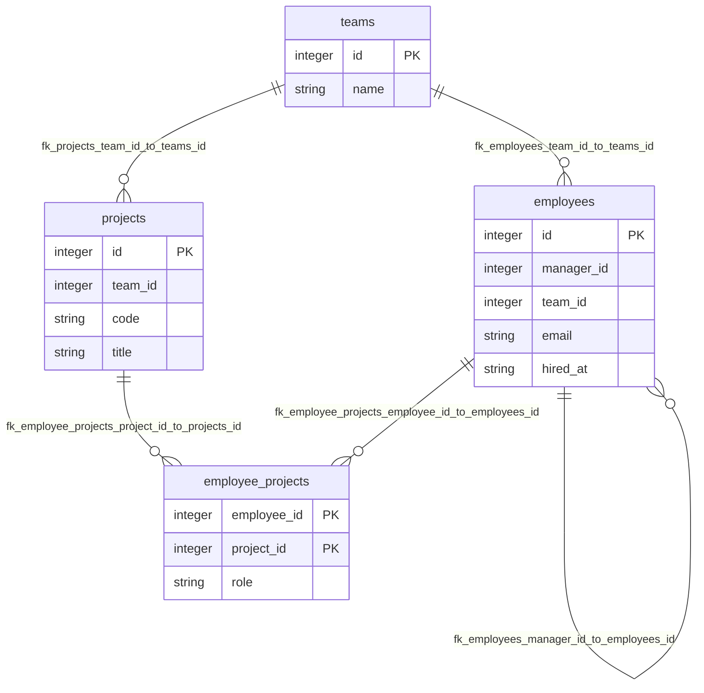

# Org DB

## Table Index
- [employee_projects](#table-employee_projects)
- [employees](#table-employees)
- [projects](#table-projects)
- [teams](#table-teams)

## Global ER Diagram

## Table: employee_projects

| Column | Type | PK/FK | Nullable | Default | Description |
|---|---|---|---|---|---|
| employee_id | Integer | PK/FK | No | - | - |
| project_id | Integer | PK/FK | No | - | - |
| role | String | - | Yes | - | - |

**Foreign Keys**
- employee_projects.project_id -> projects.id (`fk_employee_projects_project_id_to_projects_id`)
- employee_projects.employee_id -> employees.id (`fk_employee_projects_employee_id_to_employees_id`)

## Table: employees

| Column | Type | PK/FK | Nullable | Default | Description |
|---|---|---|---|---|---|
| id | Integer | PK | Yes | - | - |
| manager_id | Integer | FK | Yes | - | - |
| team_id | Integer | FK | Yes | - | - |
| email | String | - | No | - | - |
| hired_at | String | - | No | - | - |

**Foreign Keys**
- employees.team_id -> teams.id (`fk_employees_team_id_to_teams_id`)
- employees.manager_id -> employees.id (`fk_employees_manager_id_to_employees_id`)

## Table: projects

| Column | Type | PK/FK | Nullable | Default | Description |
|---|---|---|---|---|---|
| id | Integer | PK | Yes | - | - |
| team_id | Integer | FK | No | - | - |
| code | String | - | No | - | - |
| title | String | - | No | - | - |

**Foreign Keys**
- projects.team_id -> teams.id (`fk_projects_team_id_to_teams_id`)

## Table: teams

| Column | Type | PK/FK | Nullable | Default | Description |
|---|---|---|---|---|---|
| id | Integer | PK | Yes | - | - |
| name | String | - | No | - | - |
