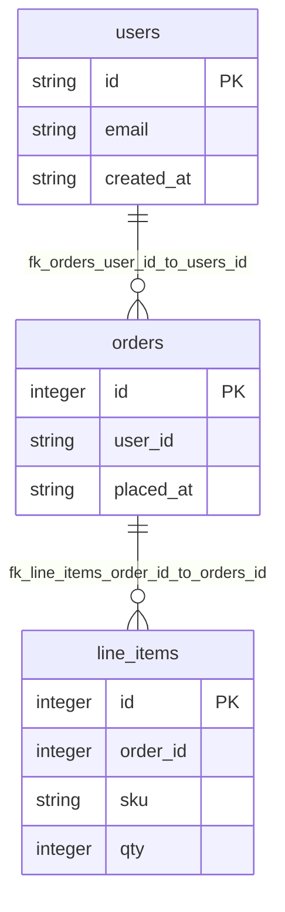

# Shop DB (TS)

## Table Index
- [line_items](#table-line_items)
- [orders](#table-orders)
- [users](#table-users)

## Global ER Diagram

## Table: line_items

| Column | Type | PK/FK | Nullable | Default | Description |
|---|---|---|---|---|---|
| id | Integer | PK | Yes | - | - |
| order_id | Integer | FK | No | - | - |
| sku | String | - | No | - | - |
| qty | Integer | - | No | - | - |

**Foreign Keys**
- line_items.order_id -> orders.id (`fk_line_items_order_id_to_orders_id`)

## Table: orders

| Column | Type | PK/FK | Nullable | Default | Description |
|---|---|---|---|---|---|
| id | Integer | PK | Yes | - | - |
| user_id | String | FK | No | - | - |
| placed_at | String | - | No | - | - |

**Foreign Keys**
- orders.user_id -> users.id (`fk_orders_user_id_to_users_id`)

## Table: users

| Column | Type | PK/FK | Nullable | Default | Description |
|---|---|---|---|---|---|
| id | String | PK | Yes | - | - |
| email | String | - | No | - | - |
| created_at | String | - | No | - | - |
