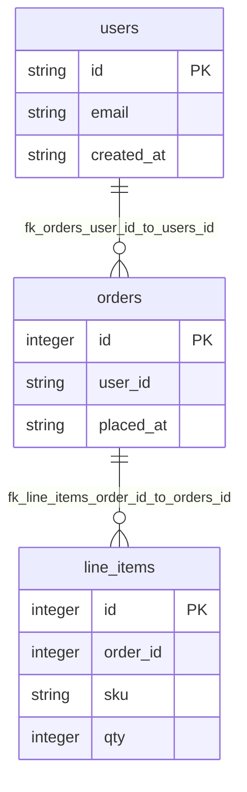

# Shop DB (TS)

## Table Index

- [line_items](#table-line-items)
- [orders](#table-orders)
- [users](#table-users)

## Global ER Diagram

## Tables

### line_items

Columns: 4 / PK: 1 / FKs: 1

| Column | Type | Attr | Null | Default | Description |
|---|---|---|---|---|---|
| id | `Integer` | PK | Yes | - | - |
| order_id | `Integer` | FK | No | - | - |
| qty | `Integer` | - | No | - | - |
| sku | `String` | - | No | - | - |

Foreign Keys

- `line_items.order_id` -> `orders.id` (`fk_line_items_order_id_to_orders_id`)

[Back to index](#table-index)

### orders

Columns: 3 / PK: 1 / FKs: 1

| Column | Type | Attr | Null | Default | Description |
|---|---|---|---|---|---|
| id | `Integer` | PK | Yes | - | - |
| placed_at | `String` | - | No | - | - |
| user_id | `String` | FK | No | - | - |

Foreign Keys

- `orders.user_id` -> `users.id` (`fk_orders_user_id_to_users_id`)

[Back to index](#table-index)

### users

Columns: 3 / PK: 1 / FKs: 0

| Column | Type | Attr | Null | Default | Description |
|---|---|---|---|---|---|
| id | `String` | PK | Yes | - | - |
| created_at | `String` | - | No | - | - |
| email | `String` | - | No | - | - |

[Back to index](#table-index)
