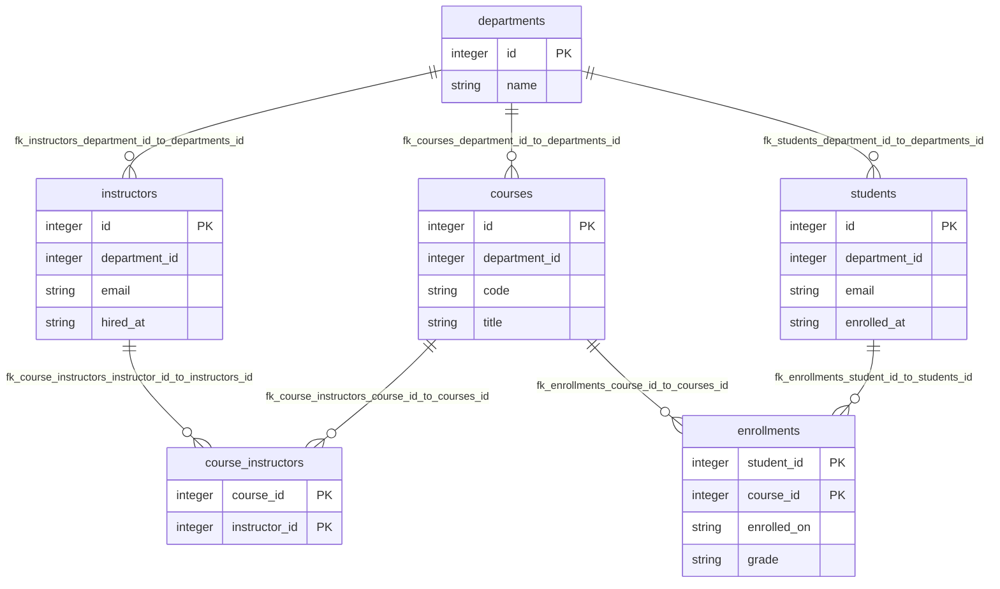

# University DB

## Table Index
- [course_instructors](#table-course_instructors)
- [courses](#table-courses)
- [departments](#table-departments)
- [enrollments](#table-enrollments)
- [instructors](#table-instructors)
- [students](#table-students)

## Global ER Diagram

## Table: course_instructors

| Column | Type | PK/FK | Nullable | Default | Description |
|---|---|---|---|---|---|
| course_id | Integer | PK/FK | No | - | - |
| instructor_id | Integer | PK/FK | No | - | - |

**Foreign Keys**
- course_instructors.instructor_id -> instructors.id (`fk_course_instructors_instructor_id_to_instructors_id`)
- course_instructors.course_id -> courses.id (`fk_course_instructors_course_id_to_courses_id`)

## Table: courses

| Column | Type | PK/FK | Nullable | Default | Description |
|---|---|---|---|---|---|
| id | Integer | PK | Yes | - | - |
| department_id | Integer | FK | No | - | - |
| code | String | - | No | - | - |
| title | String | - | No | - | - |

**Foreign Keys**
- courses.department_id -> departments.id (`fk_courses_department_id_to_departments_id`)

## Table: departments

| Column | Type | PK/FK | Nullable | Default | Description |
|---|---|---|---|---|---|
| id | Integer | PK | Yes | - | - |
| name | String | - | No | - | - |

## Table: enrollments

| Column | Type | PK/FK | Nullable | Default | Description |
|---|---|---|---|---|---|
| student_id | Integer | PK/FK | No | - | - |
| course_id | Integer | PK/FK | No | - | - |
| enrolled_on | String | - | No | - | - |
| grade | String | - | Yes | - | - |

**Foreign Keys**
- enrollments.course_id -> courses.id (`fk_enrollments_course_id_to_courses_id`)
- enrollments.student_id -> students.id (`fk_enrollments_student_id_to_students_id`)

## Table: instructors

| Column | Type | PK/FK | Nullable | Default | Description |
|---|---|---|---|---|---|
| id | Integer | PK | Yes | - | - |
| department_id | Integer | FK | No | - | - |
| email | String | - | No | - | - |
| hired_at | String | - | No | - | - |

**Foreign Keys**
- instructors.department_id -> departments.id (`fk_instructors_department_id_to_departments_id`)

## Table: students

| Column | Type | PK/FK | Nullable | Default | Description |
|---|---|---|---|---|---|
| id | Integer | PK | Yes | - | - |
| department_id | Integer | FK | No | - | - |
| email | String | - | No | - | - |
| enrolled_at | String | - | No | - | - |

**Foreign Keys**
- students.department_id -> departments.id (`fk_students_department_id_to_departments_id`)
